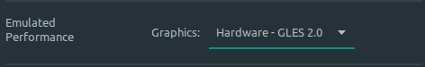

# Prerequisites


1. Android Studio
1. Flutter SDK
1. Device Emulator
1. MAC & iPhone for iOS development


### Flutter SDK
In Linux, you can install Flutter with the `snap` package:
```
snap install flutter --classic
```
Once finished, you can check the installation:
```
flutter --version
```
This will actually trigger all pending installations, once finished, the output will look somewhat like this:
```
  ╔════════════════════════════════════════════════════════════════════════════╗
  ║                 Welcome to Flutter! - https://flutter.dev                  ║
  ║                                                                            ║
  ║ The Flutter tool uses Google Analytics to anonymously report feature usage ║
  ║ statistics and basic crash reports. This data is used to help improve      ║
  ║ Flutter tools over time.                                                   ║
  ║                                                                            ║
  ║ Flutter tool analytics are not sent on the very first run. To disable      ║
  ║ reporting, type 'flutter config --no-analytics'. To display the current    ║
  ║ setting, type 'flutter config'. If you opt out of analytics, an opt-out    ║
  ║ event will be sent, and then no further information will be sent by the    ║
  ║ Flutter tool.                                                              ║
  ║                                                                            ║
  ║ By downloading the Flutter SDK, you agree to the Google Terms of Service.  ║
  ║ Note: The Google Privacy Policy describes how data is handled in this      ║
  ║ service.                                                                   ║
  ║                                                                            ║
  ║ Moreover, Flutter includes the Dart SDK, which may send usage metrics and  ║
  ║ crash reports to Google.                                                   ║
  ║                                                                            ║
  ║ Read about data we send with crash reports:                                ║
  ║ https://flutter.dev/docs/reference/crash-reporting                         ║
  ║                                                                            ║
  ║ See Google's privacy policy:                                               ║
  ║ https://policies.google.com/privacy                                        ║
  ╚════════════════════════════════════════════════════════════════════════════╝


Flutter 1.22.5 • channel stable • https://github.com/flutter/flutter.git
Framework • revision 7891006299 (5 days ago) • 2020-12-10 11:54:40 -0800
Engine • revision ae90085a84
Tools • Dart 2.10.4
```
To check what is missing in the process to install flutter, you can use the `flutter doctor` command.

### Android Studio
After installing, open Android Studio and configure your settings. When done, in the `welcome screen`, do the following:
1. Configure
1. Settings
1. Plugins
1. Search for Flutter (Browse repositories)
1. Flutter, install
1. Accept Dart install
1. Restart IDE

### Configure Virtual Device
1. Click on the icon in the top left corner displaying a mobile
1. Go through the process and Remember to enable Hardware acceleration:  
  
1. Finish

### Build your app to play on emulated device
1. Open your device opening the devices menu and clicking play.
1. Click on the play button of the top menu to build you app with device open